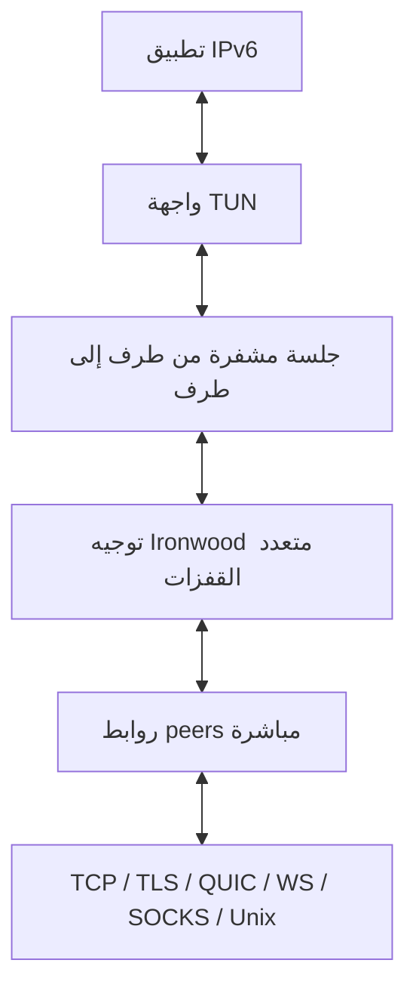

# دليل شبكة عُقَد الكامل

[فهرس التوثيق](README.md) · [مرجع الإعدادات](configuration-reference.md)
· [مرجع الإدارة](admin-api.md) · [المصدر والتوافق](UPSTREAM_COMPARISON_AR.md)

هذا الدليل يشرح كيف تعمل شبكة **UQDA Core (عُقَد)**، وكيف تُثبَّت وتُشغَّل
وتُدار على الأنظمة المدعومة. الأوامر والمسارات هنا مطابقة للإعدادات الافتراضية
الحالية في المشروع.

> [!IMPORTANT]
> عُقَد شبكة IPv6 متراكبة ومشفرة، وليست شبكة إخفاء هوية ولا بديلًا عن جدار
> الحماية. لم يخضع البروتوكول لتدقيق أمني مستقل شامل حتى الآن. احمِ المفتاح
> الخاص، وأبقِ واجهة الإدارة محلية، ولا تكشف خدمات IPv6 لا تريد مشاركتها.

## المحتويات

- [الفكرة الأساسية](#الفكرة-الأساسية)
- [مكوّنات العقدة](#مكوّنات-العقدة)
- [رحلة الحزمة داخل الشبكة](#رحلة-الحزمة-داخل-الشبكة)
- [الهوية وعناوين IPv6](#الهوية-وعناوين-ipv6)
- [النظراء والاكتشاف والتوجيه](#النظراء-والاكتشاف-والتوجيه)
- [التشفير وحدود الأمان](#التشفير-وحدود-الأمان)
- [الإعداد الدائم](#الإعداد-الدائم)
- [التثبيت والتشغيل حسب النظام](#التثبيت-والتشغيل-حسب-النظام)
- [إدارة العقدة](#إدارة-العقدة)
- [ربط عقدتين](#ربط-عقدتين)
- [التحديث والإزالة](#التحديث-والإزالة)
- [استكشاف الأعطال](#استكشاف-الأعطال)

## الفكرة الأساسية

تُنشئ عُقَد واجهة شبكة افتراضية من نوع TUN على الجهاز. يحصل كل جهاز على عنوان
IPv6 ثابت مشتق من مفتاحه العام، ثم يتصل بنظير واحد أو أكثر فوق الإنترنت أو
الشبكة المحلية. تبني العقد مسارات متعددة القفزات، بينما تكون حمولة IPv6 مشفرة
من عقدة المصدر إلى عقدة الوجهة.

لا توجد خدمة حسابات أو DHCP أو سلطة شهادات أو خادم مركزي إلزامي. يجب أن تصل
العقدة إلى الشبكة بإحدى طريقتين:

1. اكتشاف عقدة أخرى تلقائيًا عبر multicast داخل شبكة LAN نفسها؛ أو
2. إضافة عنوان peer موثوق يدويًا في الإعداد.

بعد اتصال peer وظهور المسارات، تستخدم التطبيقات عناوين IPv6 التابعة لعُقَد
كما تستخدم أي عنوان IPv6 آخر.



## مكوّنات العقدة

| المكوّن | وظيفته |
| --- | --- |
| `uqda` | الخدمة الأساسية: الهوية، الروابط، التوجيه، التشفير وواجهة TUN |
| `uqdactl` | عميل الإدارة المحلي لفحص الخدمة والـpeers والمسارات والجلسات |
| ملف الإعداد | يحفظ المفتاح الخاص والـpeers والمستمعين وسياسات الاكتشاف |
| TUN | الواجهة التي تدخل وتخرج عبرها حزم IPv6 العادية |
| Admin endpoint | قناة الإدارة المحلية التي يستخدمها `uqdactl` |

`uqda` دون خيارات يعرض المساعدة فقط. لتشغيل عقدة مؤقتة يمكن استخدام:

```bash
sudo uqda -autoconf
```

هذا الوضع ينشئ إعدادًا ومفتاحًا عشوائيين في الذاكرة. تتغير الهوية عند التشغيل
التالي، لذلك لا يُستخدم لعقدة دائمة أو خادم إنتاج.

## رحلة الحزمة داخل الشبكة

عند بدء الخدمة يحدث ما يلي:

1. يقرأ `uqda.conf` ويملأ القيم غير الموجودة بإعدادات النظام الافتراضية.
2. يحمل مفتاح Ed25519 الخاص وينشئ منه المفتاح العام والعنوان والـ`/64`.
3. يفتح مستمعي peer ويبدأ محاولات الاتصال بالـpeers الدائمين.
4. يبدأ اكتشاف multicast المسموح به.
5. ينشئ واجهة TUN ويضع عليها عنوان العقدة.
6. يفتح واجهة الإدارة المحلية.
7. يتبادل معلومات التوجيه ويبدأ نقل حركة IPv6.

عندما يرسل تطبيق حزمة إلى عنوان عُقَد:

1. تدخل الحزمة إلى TUN.
2. يبحث المصدر عن مفتاح الوجهة ومسارها.
3. ينشئ أو يعيد استخدام جلسة مشفرة مع الوجهة.
4. تمر الحمولة المشفرة عبر peer واحد أو عدة peers.
5. تتحقق عقدة الوجهة من الرسالة وتفك تشفيرها وتخرجها عبر TUN.

العقد الوسيطة تستطيع رؤية جيرانها وحجم وتوقيت الحركة وبيانات التوجيه، لكنها لا
يفترض أن ترى حمولة IPv6 الواضحة لجلسة صحيحة.

## الهوية وعناوين IPv6

كل عقدة تملك مفتاح Ed25519 خاصًا. المفتاح العام هو هوية العقدة، ويُشتق منه:

- عنوان IPv6 خاص بالعقدة `/128`؛
- شبكة IPv6 موجهة `/64` يمكن للمشغّل استخدامها لشبكة خلف العقدة.

نفس المفتاح يعطي نفس العنوان على أي نظام. حذف الإعداد أو تغيير المفتاح ينشئ
هوية وعنوانًا جديدين. لذلك ملف الإعداد نسخة احتياطية لهوية العقدة وليس مجرد
تفضيلات تشغيل.

لفحص الهوية من إعداد من دون بدء الخدمة:

```bash
uqda -useconffile ./uqda.conf -publickey
uqda -useconffile ./uqda.conf -address
uqda -useconffile ./uqda.conf -subnet
```

تصدير المفتاح الخاص عملية حساسة:

```bash
umask 077
uqda -useconffile ./uqda.conf -exportkey > uqda-private-key.pem
```

لا ترسل ملف الإعداد أو المفتاح الخاص إلى أي شخص. مشاركة **المفتاح العام** أو
عنوان IPv6 آمنة عند الحاجة للاتصال أو تثبيت هوية peer.

الـ`/64` لا يحوّل الجهاز تلقائيًا إلى gateway. توجيه أجهزة أخرى خلف العقدة
يتطلب إعداد IPv6 forwarding والمسارات والجدار الناري على نظام التشغيل بصورة
مقصودة. لا توجد أداة gateway ضمن UQDA Core.

## النظراء والاكتشاف والتوجيه

### peer مباشر أم جلسة بعيدة؟

- **peer**: عقدة متصلة مباشرة بهذه العقدة عبر ناقل مثل TLS أو QUIC.
- **path**: سلسلة القفزات التي اختارها التوجيه للوصول إلى عقدة بعيدة.
- **session**: علاقة مشفرة بين المصدر والوجهة وقد تعبر عدة peers.

لا تحتاج إلى اتصال مباشر بكل وجهة. يكفي peer مفيد للوصول إلى جزء أوسع من
الشبكة، ثم يتعلم Ironwood المسارات ويستبدل المسار عند فشل رابط أو ظهور مسار
أفضل. التشفير لا يجبر peer سيئًا على تمرير البيانات؛ يمكنه إسقاطها أو تأخيرها.

### نواقل الاتصال

| URI | اتصال صادر | استماع | الاستخدام |
| --- | --- | --- | --- |
| `tcp://` | نعم | نعم | ناقل TCP؛ حمولة الجلسة تبقى مشفرة |
| `tls://` | نعم | نعم | TCP مع TLS وهوية العقدة |
| `quic://` | نعم | نعم | ناقل QUIC |
| `ws://` | نعم | نعم | WebSocket ثنائي |
| `wss://` | نعم | لا | اتصال WebSocket آمن إلى proxy |
| `socks://` | نعم | لا | الوصول إلى peer عبر SOCKS5 |
| `sockstls://` | نعم | لا | SOCKS5 ثم TLS إلى الوجهة |
| `unix://` | نعم | نعم | رابط محلي عبر Unix socket |

مثال آمن لرابط معروف:

```hjson
Peers: [
  "tls://peer.example.net:9001?secure=required&key=PUBLIC_KEY_HEX"
]
Listen: [
  "tls://0.0.0.0:9001?secure=required"
  "tls://[::]:9001?secure=required"
]
```

`peer.example.net` و`PUBLIC_KEY_HEX` قيم توضيحية ويجب استبدالهما ببيانات peer
تملكه أو تثق به. لا يوفّر المشروع قائمة peers عامة مضمونة.

أهم خيارات URI:

| الخيار | المعنى |
| --- | --- |
| `secure=required` | يرفض fallback القديم ويشترط تأكيد المصافحة المحصّن |
| `secure=opportunistic` | يستخدم التأكيد عند دعمه مع توافق أقدم |
| `key=<hex>` | يثبت مفتاحًا عامًا مقبولًا لهوية peer |
| `password=<value>` | سر قبول للرابط المباشر، بحد أقصى 64 بايت |
| `priority=<0-255>` | أولوية الرابط |
| `maxbackoff=<duration>` | أقصى مدة انتظار قبل إعادة الاتصال، والحد الأدنى 5 ثوانٍ |
| `sni=<hostname>` | يحدد TLS SNI عند دعم الناقل له |

يجب URL-encode للأحرف الخاصة داخل URI. يخفي `uqdactl getPeers` معاملات query
عند العرض حتى لا يطبع كلمة مرور الرابط.

### اكتشاف multicast

يفحص multicast الواجهات المحلية المطابقة للقواعد. `Beacon` يعلن وجود العقدة،
و`Listen` يستقبل إعلانات الآخرين ويحاول الاتصال بهم. يعمل ذلك داخل نطاق LAN
ولا يعوض peer ثابتًا بين شبكتين مختلفتين أو خلف NAT يمنع الوصول.

كلمة مرور multicast، وكلمة مرور peer داخل URI، و`GroupPassword` ثلاث خصائص
مختلفة ولا تحمي الشيء نفسه.

## التشفير وحدود الأمان

| الطبقة | الآلية الحالية |
| --- | --- |
| الهوية والتوقيع | Ed25519 |
| اشتقاق مفاتيح الجلسة | تحويل الهوية إلى Curve25519 مع مفاتيح مؤقتة |
| تشفير الجلسة | NaCl box: Curve25519 + XSalsa20 + Poly1305 |
| منع إعادة الإرسال | nonces متزايدة وتسلسل مفاتيح |
| عزل مجموعة | سر مشتق بـArgon2id من `GroupPassword` |
| ناقل TLS/QUIC | شهادة Ed25519 ذاتية مرتبطة بهوية عُقَد |

التشفير من طرف إلى طرف يحمي الحمولة، لكنه لا يوفر إخفاء الهوية أو التوفر ضد
إسقاط الحزم أو حماية الجهاز بعد سرقة مفتاحه. `AllowedPublicKeys` يقيّد peers
الواردة المباشرة فقط؛ ليس جدار حماية ولا يحدد من يستطيع الوصول إلى خدمة IPv6.

واجهة الإدارة عبر TCP لا تملك مصادقة بروتوكولية. الإعداد الافتراضي على Windows
هو `tcp://localhost:19001` ويجب ألا يتحول إلى عنوان عام. على الأنظمة الشبيهة
بيونكس، الإعداد الافتراضي Unix socket محلي بصلاحية `0600`.

## الإعداد الدائم

أنشئ إعدادًا مرة واحدة ثم احفظه بصلاحيات مقيدة:

```bash
umask 077
uqda -genconf > uqda.conf
uqda -useconffile uqda.conf -normaliseconf >/dev/null
```

الأمر الثاني يتحقق من أن HJSON/JSON قابل للقراءة قبل إعادة تشغيل الخدمة.

أهم الحقول:

| الحقل | الوظيفة |
| --- | --- |
| `PrivateKey` / `PrivateKeyPath` | هوية العقدة؛ لا تنشرها |
| `Peers` | اتصالات صادرة دائمة يعاد طلبها تلقائيًا |
| `InterfacePeers` | peers صادرة مرتبطة بواجهة مصدر محددة |
| `Listen` | عناوين استقبال اتصالات peers |
| `AdminListen` | واجهة الإدارة المحلية أو `none` لتعطيلها |
| `MulticastInterfaces` | قواعد الإعلان والاكتشاف حسب اسم الواجهة |
| `AllowedPublicKeys` | مفاتيح peers الواردة المباشرة المسموحة |
| `GroupPassword` | يعزل جلسات حركة overlay لمجموعة بنفس السر |
| `IfName` | اسم TUN أو `auto` أو `none` لتعطيل TUN |
| `IfMTU` | MTU، ولا يجوز أن يقل عن 1280 |
| `NodeInfoPrivacy` | يمنع معلومات النظام الافتراضية من NodeInfo |
| `NodeInfo` | metadata اختيارية يمكن طلبها عبر الشبكة |

عدّل نسخة مؤقتة وتحقق منها ثم استبدل الملف الدائم. لا تستخدم `-genconf` فوق
ملف موجود لأنه سيولّد مفتاحًا جديدًا ويغيّر الهوية.

## التثبيت والتشغيل حسب النظام

### Linux مع systemd

التثبيت:

```bash
curl -fsSLO https://github.com/Uqda/Core/releases/latest/download/install.sh
sudo sh install.sh
```

المواقع والأوامر الافتراضية:

| العنصر | القيمة |
| --- | --- |
| الإعداد | `/etc/uqda.conf`، وقد يشير إلى `/etc/uqda/uqda.conf` |
| الإدارة | `unix:///var/run/uqda.sock` |
| TUN | اسم تلقائي، MTU حتى 65535 |

```bash
sudo systemctl status uqda
sudo systemctl restart uqda
sudo journalctl -u uqda -n 100 --no-pager
sudo uqdactl getSelf
sudo uqdactl getPeers
sudo uqdactl doctor
```

تحقق من الإعداد قبل إعادة التشغيل:

```bash
sudo uqda -useconffile /etc/uqda.conf -normaliseconf >/dev/null
sudo systemctl restart uqda
```

إذا لم يستخدم النظام systemd، يثبت المسار المحمول الملفات التنفيذية، لكن يجب
ربط `uqda -useconffile ...` بمدير الخدمات الخاص بالنظام يدويًا.

### macOS

التثبيت المباشر:

```bash
curl -fsSLO https://github.com/Uqda/Core/releases/latest/download/install.sh
sudo sh install.sh
```

أو Homebrew:

```bash
brew tap uqda/core https://github.com/Uqda/Core
brew trust --cask uqda/core/uqda
brew install --cask uqda/core/uqda
```

| العنصر | القيمة |
| --- | --- |
| الإعداد | `/etc/uqda.conf` |
| الإدارة | `unix:///var/run/uqda.sock` |
| الخدمة | LaunchDaemon باسم `uqda` |
| سجل stdout | `/tmp/uqda.stdout.log` |
| سجل stderr | `/tmp/uqda.stderr.log` |

```bash
sudo launchctl print system/uqda
sudo launchctl kickstart -k system/uqda
sudo uqdactl getSelf
sudo uqdactl getPeers
sudo uqdactl doctor
tail -n 100 /tmp/uqda.stdout.log /tmp/uqda.stderr.log
```

الحزم الحالية غير موقعة من Apple، لكن المثبت يتحقق من SHA-256 قبل استدعاء
مثبت النظام. لا تعطل Gatekeeper على مستوى الجهاز.

### Windows

تنبيه للإصدار القادم: تغييرات فصل MSI وWintun ومنفذ الإدارة 19001 هنا تخص
البناء الجديد؛ لا تغيّر حزمة v0.1.9 التي سبق تنزيلها. تثبيت UQDA القديم يحتاج
انتقالًا مع حفظ الهوية؛ راجع [إرشادات Windows والانتقال](windows-installation.md).

نزّل MSI المطابق لـ`x64` أو`x86` أو`ARM64` وشغّله كمسؤول. يغلق المستخدم
PowerShell ويفتح نافذة جديدة **Run as Administrator** بعد التثبيت لكي يصل PATH
المحدّث إلى العملية.

| العنصر | القيمة |
| --- | --- |
| الإعداد | `%ProgramData%\UQDA\uqda.conf` |
| السجل | `%ProgramData%\UQDA\uqda.log` |
| الإدارة | `tcp://localhost:19001` |
| TUN | واجهة `UQDA` عبر Wintun، MTU حتى 65535 |
| الخدمة | Windows Service باسم `UQDA` وتعمل كـLocalSystem |

```powershell
uqda.exe -version
Get-Service UQDA
uqdactl.exe getSelf
uqdactl.exe getPeers
uqdactl.exe doctor
```

الخيارات يجب أن تأتي قبل أمر `uqdactl`:

```powershell
uqdactl.exe -json getSelf
uqdactl.exe -endpoint=tcp://localhost:19001 getPeers
```

تحقق من الإعداد ثم أعد تشغيل الخدمة:

```powershell
$Config = "$env:ProgramData\UQDA\uqda.conf"
uqda.exe -useconffile $Config -normaliseconf | Out-Null
if ($LASTEXITCODE -ne 0) { throw "Invalid UQDA configuration" }
Restart-Service UQDA
Get-Content "$env:ProgramData\UQDA\uqda.log" -Tail 100
```

إذا لم يتعرف PowerShell إلى الأمر، استخدم المسار الكامل أو ادخل مجلد التثبيت
واكتب `\.\uqda.exe`؛ PowerShell لا يشغّل ملف المجلد الحالي بالاسم فقط:

```powershell
& "$env:ProgramFiles\UQDA\uqda.exe" -version
& "$env:ProgramFiles\UQDA\uqdactl.exe" getSelf
```

على نظام x86 قد يكون المسار `C:\Program Files (x86)\UQDA`. إذا قالت الرسالة
إن **Application Control Policy** حجبت `uqdactl.exe` فالمشكلة WDAC/AppLocker
وليست PATH أو الشبكة. لا تحاول تجاوز سياسة المؤسسة؛ يلزم توقيع موثوق أو قاعدة
سماح يطبقها مسؤول Windows. إصدار x64 هو الذي يخضع لاختبار تثبيت وخدمة وPATH
وإزالة كامل في CI؛ حزم x86 وARM64 تُبنى وتُفحص بنيويًا.

### FreeBSD

المثبت يضع الملفات التنفيذية في `/usr/local/bin` وينشئ الإعداد في:

```text
/usr/local/etc/uqda.conf
```

الإعدادات الافتراضية: إدارة عبر `/var/run/uqda.sock`، وTUN باسم
`/dev/tun0`، وMTU يساوي 32767. الحزمة المحمولة لا تسجّل خدمة rc تلقائيًا؛ يجب
إنشاء خدمة محلية تستخدم الأمر التالي:

```sh
/usr/local/bin/uqda -useconffile /usr/local/etc/uqda.conf
```

ثم تُدار وفق rc.d الخاص بالنظام. لا تستخدم سكربت خدمة بمسار إعداد
`/etc/uqda.conf` من دون تعديله ليتوافق مع المسار أعلاه. إصدارات FreeBSD تُبنى
بـcross-compilation في CI ولا تُشغّل داخل FreeBSD حقيقي في CI حاليًا.

### OpenBSD

المثبت يضع الملفات في `/usr/local/bin` وينشئ `/etc/uqda.conf`. الإعداد
الافتراضي للإدارة `/var/run/uqda.sock`، والواجهة `tun0`، وMTU يساوي 16384.

تحقق من الإعداد ثم أنشئ خدمة `rcctl` محلية تشغّل:

```sh
/usr/local/bin/uqda -useconffile /etc/uqda.conf
```

الحزمة لا تنشئ إعداد `rcctl` كاملًا تلقائيًا، وبناء OpenBSD في CI متقاطع وليس
اختبار تشغيل على مضيف OpenBSD.

### Docker / Podman

حزمة GitHub Container Registry الرسمية:

```bash
docker pull ghcr.io/uqda/core:latest
docker run --rm -it \
  --cap-add=NET_ADMIN \
  --device=/dev/net/tun \
  -v uqda-config:/etc/uqda \
  ghcr.io/uqda/core:latest
```

ينشئ entrypoint الملف `/etc/uqda/config.conf` أول مرة. لا تحذف volume إذا
كنت تريد الاحتفاظ بهوية العقدة. فعّل `ALLOW_IPV6_FORWARDING` فقط إذا كان
الحاوي موجّهًا عمدًا لحركة أجهزة أخرى.

مع Podman يجب توفير صلاحية TUN و`NET_ADMIN` بما يتوافق مع وضع root/rootless؛
لا تكفي صورة الحاوية وحدها لإنشاء TUN من دون صلاحيات kernel المناسبة.

### EdgeOS وVyOS

بعد تثبيت حزمة `.deb` المطابقة للنظام:

```text
configure
set interfaces uqda tun0
set interfaces uqda tun0 description UQDA
commit
save
```

كل `tunN` يملك إعدادًا وadmin socket وخدمة `uqda@tunN.service` مستقلة. بعد
تغيير الإعداد المتقدم استخدم:

```text
restart uqda tun0
```

راجع [دليل EdgeOS وVyOS](../contrib/vyatta/README.md) للتفاصيل الخاصة بالحزمة.

### OpenWrt والهواتف

OpenWrt هدف بناء من المصدر فقط، وليس ضمن المثبت ذي الأمر الواحد ولا ضمن حزم
الإصدار المختبرة. يوجد wrapper للدمج مع تطبيقات الهواتف، لكنه ليس تطبيقًا
نهائيًا عامًا ولا حزمة تثبيت للمستخدم.

## إدارة العقدة

على Linux وmacOS وBSD شغّل `uqdactl` بصلاحيات administrator/root. على Windows
استخدم PowerShell مرتفع الصلاحية.

| الأمر | ماذا يعرض أو يفعل |
| --- | --- |
| `uqdactl list` | الأوامر التي تدعمها الخدمة الجارية وحقول كل أمر |
| `uqdactl getSelf` | الإصدار، العنوان، subnet، المفتاح العام وحجم جدول التوجيه |
| `uqdactl getPeers` | peers المباشرة وحالتها وRTT والحركة والخطأ الأخير |
| `uqdactl doctor` | فحص الخدمة والهوية والإدارة وTUN والـpeers والتوجيه وmulticast |
| `uqdactl getTree` | شجرة التوجيه المعروفة |
| `uqdactl getPaths` | المسارات المنشأة |
| `uqdactl getSessions` | جلسات الحركة المشفرة مع العقد البعيدة |
| `uqdactl getMulticastInterfaces` | واجهات الاكتشاف الفعلية |
| `uqdactl getTUN` | اسم TUN وحالته وMTU |
| `uqdactl addPeer uri=...` | إضافة peer للعملية الجارية |
| `uqdactl removePeer uri=...` | إزالة peer من العملية الجارية |

الإضافة والإزالة عبر admin تغيران حالة العملية الحالية فقط. لجعل peer دائمًا
عدّل `Peers` أو`InterfacePeers` في ملف الإعداد ثم تحقق منه وأعد تشغيل الخدمة.

لأدوات المراقبة استخدم JSON، مع وضع الخيار قبل الأمر:

```bash
sudo uqdactl -json getSelf
sudo uqdactl -json getPeers
sudo uqdactl -json doctor
```

رمز خروج `doctor`: صفر عند النجاح، 2 عند التحذير، و1 عند الفشل. التحذير بغياب
peers طبيعي لعقدة تعمل وحدها لكنه يعني أن الشبكة الخارجية غير قابلة للوصول.

## ربط عقدتين

### داخل LAN واحدة

1. ثبّت عُقَد على الجهازين.
2. تأكد أن قواعد `MulticastInterfaces` تسمح `Beacon` و`Listen` للواجهة المطلوبة.
3. أعد تشغيل الخدمتين.
4. افحص `getMulticastInterfaces` ثم `getPeers`.
5. بعد الاتصال انتظر تقارب التوجيه وافحص `doctor` و`getTree`.

إذا كان جدار LAN يمنع multicast، استخدم peer ثابتًا.

### بين شبكتين

على العقدة القابلة للاستقبال افتح مستمعًا، مثال:

```hjson
Listen: [ "tls://[::]:9001?secure=required" ]
```

اسمح بالمنفذ في جدار الحماية/NAT حسب البنية. على العقدة الأخرى أضف عنوانها
ومفتاحها العام:

```hjson
Peers: [
  "tls://HOST_OR_IP:9001?secure=required&key=PUBLIC_KEY_HEX"
]
```

بعد إعادة التشغيل:

```bash
sudo uqdactl getPeers
sudo uqdactl doctor
sudo uqdactl getTree
```

اختبر عنوان عقدة الوجهة باستخدام أداة IPv6 المناسبة للنظام مثل `ping -6`.
نجاح اتصال TCP/TLS بالـpeer لا يعني وحده أن التوجيه اكتمل؛ يجب أن يكون peer
`Up` ويزيد جدول التوجيه وتظهر الوجهة أو مسارها.

لا يوجد `-nameserver` في UQDA Core. DNS وSOCKS وport forwarding على مستوى
المستخدم تنتمي إلى مشاريع أو طبقات أخرى، وليست خيارات لخدمة `uqda`.

## التحديث والإزالة

التحديث على الأنظمة الشبيهة بيونكس:

```bash
curl -fsSLO https://github.com/Uqda/Core/releases/latest/download/updater.sh
sudo sh updater.sh
```

Homebrew:

```bash
brew update
brew upgrade --cask uqda/core/uqda
```

إذا لم يتغير artifact فلن يعيد Homebrew التثبيت. استخدم `brew reinstall`
فقط لإصلاح تثبيت نفس الإصدار، وليس كطريقة تحديث عادية.

الإزالة مع حفظ الهوية:

```bash
brew uninstall --cask uqda/core/uqda
```

أو باستخدام uninstaller الرسمي. الإزالة الدائمة تحتاج `--purge` وتأكيد كلمة
`PURGE` حرفيًا، وليس `uqda`:

```bash
curl -fsSLO https://github.com/Uqda/Core/releases/latest/download/uninstall.sh
sudo sh uninstall.sh --dry-run --purge
sudo sh uninstall.sh --purge
```

على Windows استخدم Apps & Features أو:

```powershell
winget list UQDA
```

ثم أزل MSI بالطريقة النظامية. إزالة MSI تحفظ `%ProgramData%\UQDA` حتى تبقى
الهوية لإعادة التثبيت؛ حذف هذا المجلد يدويًا يعني حذف الهوية نهائيًا.

## استكشاف الأعطال

ابدأ دائمًا بهذه السلسلة:

1. هل الخدمة تعمل؟
2. هل واجهة الإدارة المحلية قابلة للوصول؟
3. هل TUN فعالة؟
4. هل يوجد peer حالته `Up`؟
5. هل جدول التوجيه أكبر من عقدة واحدة؟
6. هل توجد session عند إرسال حركة إلى الوجهة؟

```bash
sudo uqdactl doctor
sudo uqdactl getTUN
sudo uqdactl getMulticastInterfaces
sudo uqdactl getPeers
sudo uqdactl getTree
sudo uqdactl getPaths
sudo uqdactl getSessions
```

| العَرَض | السبب الأقرب | الإجراء |
| --- | --- | --- |
| `command not found` | PATH لم يتحدث أو الحزمة غير مثبتة | افتح terminal جديدًا وافحص المسار الكامل |
| `flag provided but not defined: -nameserver` | الخيار ليس في Core | لا تستخدمه مع `uqda` |
| `-address` يطلب config | العنوان مشتق من الهوية المحفوظة | أضف `-useconffile` |
| `getPeers` فارغ | لا peer ثابت ولا اكتشاف LAN ناجح | راجع multicast أو أضف peer موثوقًا |
| `connection refused` إلى admin | الخدمة متوقفة أو `AdminListen` مختلف | افحص الخدمة والسجل والإعداد |
| الخدمة تفشل بعد تعديل config | HJSON/JSON أو قيمة غير صالحة | تحقق بـ`-normaliseconf` واستعد النسخة الاحتياطية |
| peer يظهر `Down` | DNS أو جدار أو URI أو key/password خاطئ | اقرأ `Last Error` في `getPeers` |
| peer `Up` ولا وصول | التوجيه لم يتقارب أو GroupPassword مختلف | افحص `doctor` و`getTree` و`getPaths` |
| Windows حجب `uqdactl.exe` | WDAC/AppLocker للملف غير الموقع | توقيع موثوق أو قاعدة سماح إدارية |
| TUN غير فعالة | صلاحيات أو driver/kernel | شغّل الخدمة كمسؤول وافحص Wintun أو `/dev/net/tun` |

أخطاء مثل `file already closed` أثناء إيقاف الخدمة قد تظهر بعد إغلاق TUN ضمن
تسلسل الإنهاء. قيّمها مع حالة إعادة التشغيل والسجل اللاحق؛ ليست وحدها دليلًا
على فساد الهوية أو الإعداد.

للتفاصيل الأعمق عن البروتوكول والتشفير وبناء المشروع راجع
[الدليل الإنجليزي الشامل](PROJECT_GUIDE.md).
