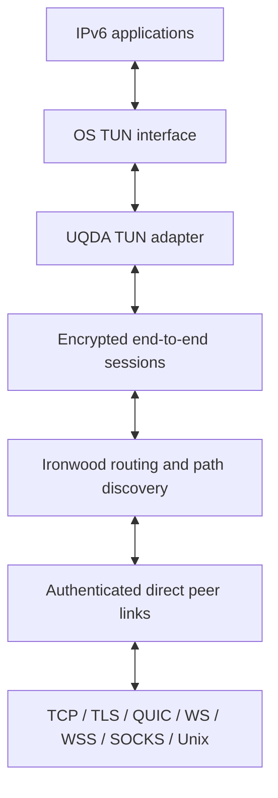
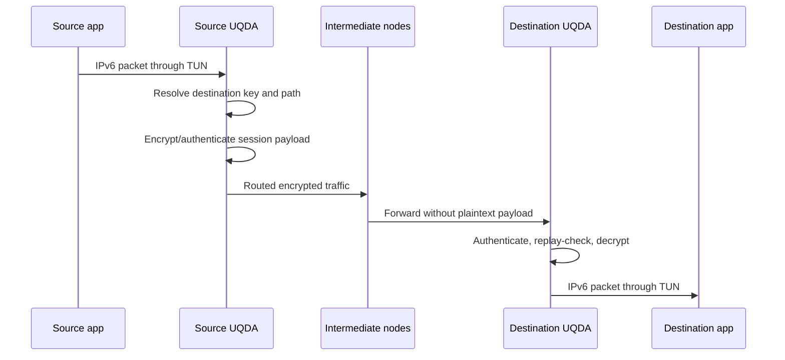

# UQDA Core: complete project guide

This document explains what UQDA Core is, how its components fit together,
how identity, routing, and encryption work, and how to install, configure,
operate, verify, and develop the project. It is written for users, network
operators, reviewers, and contributors who want more than a quick-start.

> [!IMPORTANT]
> UQDA has not been independently security-audited. It is an encrypted IPv6
> overlay, not an anonymity network. Use an IPv6 firewall, protect private
> keys and administration sockets, and run the latest stable release.

## Contents

- [The idea in one minute](#the-idea-in-one-minute)
- [What UQDA is and is not](#what-uqda-is-and-is-not)
- [Architecture](#architecture)
- [Node lifecycle and packet flow](#node-lifecycle-and-packet-flow)
- [Identity and IPv6 addressing](#identity-and-ipv6-addressing)
- [Peer links and discovery](#peer-links-and-discovery)
- [Routing](#routing)
- [Cryptography and protocol security](#cryptography-and-protocol-security)
- [Security boundaries and limitations](#security-boundaries-and-limitations)
- [Installation by operating system](#installation-by-operating-system)
- [Configuration](#configuration)
- [Common deployment patterns](#common-deployment-patterns)
- [Operation and administration](#operation-and-administration)
- [Updates, release verification, and provenance](#updates-release-verification-and-provenance)
- [Troubleshooting](#troubleshooting)
- [Codebase and development model](#codebase-and-development-model)
- [Testing and release process](#testing-and-release-process)
- [Terminology](#terminology)

## The idea in one minute

UQDA creates a virtual IPv6 network on top of existing IPv4 or IPv6
connectivity. Every node owns an Ed25519 key pair. The public key identifies
the node and deterministically produces its UQDA IPv6 address and routed `/64`
subnet. The private key proves that identity.

Nodes connect to one or more direct peers using carriers such as TCP, TLS,
QUIC, WebSocket, secure WebSocket, SOCKS, or Unix sockets. UQDA authenticates
those peers, builds a self-organizing multi-hop topology, discovers paths, and
creates encrypted sessions between the source and destination nodes. Ordinary
applications use the network through a TUN interface, so they send and receive
normal IPv6 packets rather than UQDA-specific messages.

There is no central address registry, account service, certificate authority,
or mandatory coordinator. Connectivity comes from configured peer links and
optional local multicast discovery.

## What UQDA is and is not

UQDA is:

- an encrypted, self-organizing IPv6 overlay;
- a userspace router connected to the operating system through TUN;
- a mesh in which direct peer links can carry traffic for other nodes;
- a stable cryptographic identity whose IPv6 address follows its public key;
- transport-independent: the encrypted overlay can run over several carriers;
- derived from the open-source Yggdrasil/Ironwood lineage, with UQDA-specific
  hardening, packaging, documentation, and release automation.

UQDA is not:

- an anonymity system: a direct peer can normally see the source IP address of
  the underlying connection, and traffic timing/volume can reveal metadata;
- a traditional centralized VPN with a server-assigned address pool;
- a substitute for host firewalls or application authentication;
- a guarantee that every route is available, low-latency, or honest;
- independently security-audited at this time.

## Architecture



The main runtime has five cooperating layers:

1. **Configuration and identity** load or generate the Ed25519 private key,
   derive the public identity, and apply platform defaults.
2. **Link management** opens configured listeners, dials persistent peers,
   retries failed connections with bounded exponential backoff, and accepts
   multicast-discovered local peers.
3. **Routing** maintains direct peer state, a signed routing tree, Bloom-filter
   reachability information, and discovered source paths.
4. **Encrypted sessions** authenticate destinations and protect IPv6 payloads
   across the complete routed path, including paths with intermediate nodes.
5. **Platform integration** reads/writes IPv6 packets through TUN and exposes a
   local administration API used by `uqdactl`.

## Node lifecycle and packet flow

At startup, a normal node:

1. reads HJSON/JSON configuration and fills missing fields with platform
   defaults;
2. loads the Ed25519 private key and creates a self-signed certificate using
   the same identity;
3. derives its UQDA IPv6 `/128` address and routed `/64` subnet;
4. starts configured peer listeners and persistent outbound peer attempts;
5. starts optional multicast discovery on matching local interfaces;
6. creates and configures the TUN interface;
7. opens the local administration socket; and
8. begins exchanging routing information and carrying IPv6 traffic.

For one application packet, the logical path is:



Intermediate nodes participate in routing and can observe routing metadata,
packet size, timing, and adjacent peers. They should not receive the plaintext
IPv6 payload of a valid end-to-end encrypted session.

## Identity and IPv6 addressing

### Key pair

Each node uses an Ed25519 identity:

- a 32-byte public key identifies the node;
- a 64-byte private key signs handshakes and session setup messages;
- the private key can be stored directly in the configuration or as a PKCS#8
  PEM file selected with `PrivateKeyPath`.

The private key is the identity. Replacing it changes the public key, IPv6
address, and subnet. Back up the configuration securely and never publish the
private key. The release installers preserve an existing configuration during
an upgrade.

### Deterministic address and subnet

UQDA derives two values from the public key:

- one node address used as a `/128`; and
- one routed `/64` prefix that can represent a network behind the node.

The current scheme starts node addresses in UQDA's `0x02` prefix space and
marks routed subnet prefixes by setting the corresponding subnet bit. It then
encodes a prefix of the bitwise-inverted Ed25519 public key, including the
count of its leading one bits, into the remaining address bits. This is a
deterministic encoding, not a centrally allocated address and not a simple
hash of a username.

Consequences:

- the same private key produces the same address on every restart and system;
- another party can verify the binding between the address and the public key;
- no DHCP server or address registry is needed;
- changing the key intentionally creates a new network identity.

Inspect identity without starting the daemon:

```bash
uqda -useconffile ./uqda.conf -publickey
uqda -useconffile ./uqda.conf -address
uqda -useconffile ./uqda.conf -subnet
```

Export the private key only into protected storage:

```bash
umask 077
uqda -useconffile ./uqda.conf -exportkey > uqda-private-key.pem
```

## Peer links and discovery

### Direct peers versus remote sessions

A **peer** is a directly connected UQDA node over an underlying carrier. A
**session** is an end-to-end encrypted relationship with a destination node;
it may cross several direct peers. A node needs at least one useful peer to
reach a wider overlay, but it does not need a direct peer connection to every
destination.

UQDA has no special bootstrap-node role. Operators choose peers appropriate
for their network. Nearby, reliable, low-latency peers generally provide
better performance than a long list of distant peers.

### Supported carrier URIs

| Scheme | Outbound | Listener | Purpose |
| --- | --- | --- | --- |
| `tcp://` | Yes | Yes | Plain carrier; UQDA payload sessions remain encrypted |
| `tls://` | Yes | Yes | TLS carrier using the node's self-issued identity certificate |
| `quic://` | Yes | Yes | QUIC stream carrier |
| `ws://` | Yes | Yes | Binary WebSocket carrier; supports health paths on listeners |
| `wss://` | Yes | No | Secure WebSocket client; place a `ws://` listener behind a reverse proxy |
| `socks://` | Yes | No | Connect to a target through a SOCKS5 proxy |
| `sockstls://` | Yes | No | SOCKS5 connection with TLS to the target |
| `unix://` | Yes | Yes | Local Unix-domain carrier |

Example links:

```hjson
Peers: [
  "tls://peer.example.net:9001?secure=required"
  "quic://peer.example.net:9002?secure=required"
]
Listen: [
  "tls://0.0.0.0:9001?secure=required"
  "tls://[::]:9001?secure=required"
]
```

Global URI query options include:

| Option | Meaning |
| --- | --- |
| `secure=required` | Reject peers that do not support transcript-bound confirmation |
| `secure=opportunistic` | Use confirmation when supported; retain protocol 0.5 compatibility |
| `key=<hex-public-key>` | Pin one or more acceptable authenticated peer identities |
| `password=<value>` | Optional per-link shared password, limited to 64 bytes |
| `priority=<0-255>` | Set link priority |
| `maxbackoff=<duration>` | Limit reconnect backoff; minimum is 5 seconds |
| `sni=<hostname>` | Override TLS SNI on carrier types that support it |

Passwords and other special characters in a URI must be URL-encoded. Query
parameters are removed from peer URIs shown by `uqdactl`, so link passwords
are not printed in the normal peer table.

### Local multicast discovery

Multicast discovery periodically examines matching, active, multicast-capable
interfaces. A beacon can announce the node's protocol version, public key,
listener port, and an optional password-derived hash. Listening nodes can then
form ephemeral local peer links automatically.

`Beacon` controls advertisement and `Listen` controls discovery/connection.
The optional multicast-interface password limits which local advertisements
match; it is separate from `GroupPassword` and from a peer URI password.

Disable multicast on an interface class by setting both values to `false`, or
replace the default rules with a narrow regular expression.

## Routing

UQDA's routing layer is derived from Ironwood. At a high level it:

- authenticates direct peer identities;
- exchanges signed routing information;
- maintains a spanning-tree view rooted by public-key ordering;
- considers measured direct-link latency when selecting among paths toward
  the same root;
- distributes Bloom-filter reachability summaries;
- performs destination-key path lookups;
- caches discovered source paths and refreshes broken paths; and
- forwards encrypted traffic across direct peers.

The routing system is adaptive: peer loss removes affected state, persistent
links reconnect with backoff, paths time out, and new lookups can replace stale
or broken paths. This makes the mesh self-organizing, but it does not make it
Byzantine-fault-proof. A malicious or failing router can drop, delay, reorder,
or misroute traffic. Authenticated encryption protects payload integrity and
confidentiality; it cannot force an intermediate node to forward a packet.

## Cryptography and protocol security

This section describes the current implementation, not a formal proof or
independent audit.

### Security layers

| Layer | Current mechanism | Primary purpose |
| --- | --- | --- |
| Node identity | Ed25519 | Stable identity and signatures |
| Peer hello | BLAKE2b-512 plus Ed25519 signatures | Authenticate version metadata and optional link password |
| Hardened confirmation | Fresh 32-byte nonces, domain-separated transcript hash, Ed25519 signatures | Bind both hellos to one connection and resist replay/downgrade |
| Session key agreement | Ed25519 identity converted to Curve25519 plus ephemeral Curve25519 keys | Establish destination-authenticated shared secrets |
| Session encryption | NaCl `box` (`Curve25519` + `XSalsa20` + `Poly1305`) | End-to-end confidentiality and integrity |
| Replay control | Monotonic per-key nonces and key sequence numbers | Reject repeated or stale session traffic |
| Group isolation | Argon2id-derived 32-byte secret used in session authentication | Admit only nodes with the same group password |
| TLS/QUIC carrier | Self-issued Ed25519 certificate; TLS 1.3 for direct TLS configuration | Additional protection for the direct carrier |

### Peer handshake

The current wire protocol reports major/minor version `0.5`. Each hello is a
length-delimited metadata message containing the protocol version, Ed25519
public key, priority, a fresh random nonce, capabilities, and signatures.

New nodes sign a domain-separated BLAKE2b-512 hash of the extension transcript.
When both sides advertise handshake confirmation, each also signs a
domain-separated hash of both complete hellos. Public keys order the two
hellos consistently before hashing. Because both hellos contain fresh random
nonces, a captured confirmation should not validate on a different connection.

For compatibility, a legacy protocol 0.5 signature is still present. By
default, a new node can connect to a legacy 0.5 peer that does not advertise
confirmation. Use `?secure=required` on both the listener and peer URI for a
controlled link that must reject that fallback.

The optional URI `password` is used as keyed input to the handshake hashes. It
is a link admission secret, not a replacement for strong node identities and
not the same setting as `GroupPassword`.

### TLS identity binding

UQDA creates a self-signed Ed25519 certificate from the node identity. It does
not use a public Web PKI certificate chain for direct UQDA TLS links. After the
UQDA handshake authenticates the remote public key, direct TLS connections
verify that the peer certificate contains the same Ed25519 identity. The code
uses custom verification deliberately; `InsecureSkipVerify` in the TLS config
does not mean that the peer identity is accepted without a UQDA check.

### End-to-end session setup

The encrypted session layer converts Ed25519 identity keys to Curve25519 where
needed. A session-init message includes ephemeral current and next Curve25519
public keys, key-sequence state, and a timestamp-like sequence value. The
sender signs the setup material with its Ed25519 identity and encrypts it to
the destination. The destination decrypts it, verifies the signature, and
returns an authenticated acknowledgement.

Traffic messages include key-sequence numbers and a monotonic nonce. The
encrypted content contains the next public key plus the IPv6 payload. Receivers
reject invalid authentication tags, non-increasing nonces, stale sequences,
and malformed messages. Sessions expire after inactivity, and keys advance as
the two sides exchange updated current/next key material. This is a custom
ratcheting design and should not be described as the Signal Double Ratchet.

### Group password

When `GroupPassword` is non-empty, UQDA derives a 32-byte group-authentication
secret with Argon2id using:

- domain salt: `ironwood/encrypted/group-auth/v2`;
- 3 iterations;
- 64 MiB of memory;
- parallelism 4; and
- a 32-byte output.

The derived secret is included as a preimage in Ed25519 session-init
authentication. Nodes with different group passwords cannot establish valid
traffic sessions, although direct peering and routing can still occur. The
payload encryption layer remains active with or without a group password.

The Argon2id group-auth format introduced in UQDA 0.1.1 is not compatible with
the older group-password derivation. Upgrade all nodes in one password-protected
group together.

### Three different password settings

| Setting | Scope | What it controls |
| --- | --- | --- |
| Peer URI `password=` | One configured/listening link | Direct-link handshake admission |
| Multicast interface `Password` | One class of local interfaces | Which discovery beacons match |
| `GroupPassword` | End-to-end overlay traffic | Which node identities can form traffic sessions |

Do not use the same weak human password everywhere. Store secrets in a
root-readable configuration and avoid placing URI passwords in shell history.

## Security boundaries and limitations

UQDA protects against some threats, not every threat.

### It is designed to provide

- cryptographic node identities;
- authenticated peer handshakes;
- end-to-end authenticated encryption of overlay payloads;
- replay checks within encrypted sessions;
- optional public-key pinning and peer admission controls;
- optional password-isolated traffic groups; and
- signed release manifests and build provenance for stable artifacts.

### It does not provide

- anonymity from direct peers, endpoint systems, or traffic analysis;
- availability against a peer that drops or delays traffic;
- protection after the local private key or endpoint is compromised;
- automatic host firewall policy;
- public-CA authentication for self-issued UQDA identities;
- a formal guarantee that routing metadata from every participant is honest;
- protocol-level authentication on a TCP administration endpoint.

`AllowedPublicKeys` limits authenticated **incoming direct peer connections**.
It does not limit outgoing peers, local multicast peers, or which remote nodes
can reach an exposed IPv6 service. It is explicitly not a firewall.

The default Unix administration socket is local and is set to mode `0600`.
`uqdactl` requires administrator privileges on Unix-like systems. If an
operator replaces the Unix socket with a TCP administration listener, that
endpoint has no built-in authentication and must be restricted to a trusted
local boundary by other controls.

`NodeInfo` can be requested across the overlay. Enable `NodeInfoPrivacy` and
avoid publishing identifying metadata if this matters to the deployment.

## Installation by operating system

The verified installer discovers the latest stable GitHub release, identifies
the OS and CPU, selects an available native package or archive, downloads
`SHA256SUMS`, verifies the selected asset, and installs it.

```bash
curl -fsSLO https://github.com/Uqda/Core/releases/latest/download/install.sh
sudo sh install.sh
```

Pin a particular stable version when reproducibility is required:

```bash
sudo sh install.sh --version v0.1.1
```

Preview selection without changing the system:

```bash
sh install.sh --dry-run
```

### Platform matrix

| Platform | Release path | Service/configuration notes |
| --- | --- | --- |
| Debian/Ubuntu | Verified installer selects `.deb` | systemd service; root-only admin socket |
| Fedora and systemd Linux | Verified installer selects portable archive | installs binaries and creates/enables a systemd service |
| Other Linux | Portable archive where the CPU is published | binaries install to `/usr/local/bin`; service setup depends on the host |
| macOS Apple Silicon/Intel | Verified unsigned `.pkg`, or Homebrew Cask | launchd; `/etc/uqda.conf`; `/var/run/uqda.sock` |
| Windows x64/x86/ARM64 | Download matching `.msi` from the release | LocalSystem service; x64 is install-tested in CI, x86/ARM64 are build-validated |
| FreeBSD amd64/arm64 | Verified portable archive | config under `/usr/local/etc`; finish rc service setup |
| OpenBSD amd64/arm64 | Verified portable archive | config under `/etc`; finish `rcctl` setup |
| EdgeOS 2.x | Verified target-specific `.deb` | Vyatta-style `interfaces uqda` integration |
| VyOS 1.3 | Verified target-specific `.deb` | one service/config/admin socket per UQDA interface |
| Docker | Build the supplied Dockerfile | requires TUN device and `NET_ADMIN` |
| OpenWrt | Linux-compatible source build only | not in the one-command installer and not release-validated |
| Mobile embedding | Go mobile wrapper exists | integration API, not a general end-user release package |

### macOS

Direct installation supports both Apple Silicon and Intel:

```bash
curl -fsSLO https://github.com/Uqda/Core/releases/latest/download/install.sh
sudo sh install.sh
```

The project currently has no paid Apple Developer account. macOS packages are
therefore explicitly named `*-unsigned.pkg`. The command-line installer checks
the package SHA-256 before invoking the macOS installer. Do not disable
Gatekeeper globally.

Homebrew uses the same verified installer through a project-owned Cask:

```bash
brew tap uqda/core https://github.com/Uqda/Core
brew trust --cask uqda/core/uqda
brew install --cask uqda/core/uqda
```

Homebrew requires explicit trust for third-party executable Casks. Trusting
only `uqda/core/uqda` is narrower than trusting the complete tap. The Cask pins
a stable version and the SHA-256 of that version's `install.sh`; the installer
then verifies the selected UQDA package against the release `SHA256SUMS`. For
publisher-identity verification, use the Sigstore procedure later in this guide.

### Windows

Download the MSI matching the machine (`x64`, `x86`, or `arm64`) from the
latest release and run it as an administrator. The package installs `uqda.exe`,
`uqdactl.exe`, and Wintun, creates a per-machine `UQDA` service running as
`LocalSystem`, and starts it automatically. The persistent configuration is:

```text
%ProgramData%\UQDA\uqda.conf
```

The service log is written under the same directory. The default Windows admin
endpoint is `tcp://localhost:9001`; keep it bound to localhost.

The MSI adds its installation directory to the machine `PATH`. Close and open
PowerShell after installation so the new process receives the updated
environment, then run these commands from an elevated window:

```powershell
uqda.exe -version
uqdactl.exe list
uqdactl.exe getSelf
uqdactl.exe getPeers
uqdactl.exe doctor
Get-Service UQDA
Restart-Service UQDA
```

PowerShell does not search the current directory for executables. With an older
package that does not register `PATH`, change to the quoted installation path
and use an explicit `.\` prefix:

```powershell
cd "C:\Program Files (x86)\UQDA"
.\uqda.exe -version
.\uqdactl.exe getSelf
```

The x64 and ARM64 packages normally use `C:\Program Files\UQDA`; x86 normally
uses `C:\Program Files (x86)\UQDA`. CI performs a complete install, service,
command, PATH, and uninstall test for x64. The x86 and ARM64 MSIs are built and
inspected but are not installed on native hardware in CI. Standard MSI uninstall removes the service,
binaries, Wintun payload, and PATH entry while preserving `%ProgramData%\UQDA`
so a later reinstall keeps the same node identity.

### Docker

```bash
docker build -t uqda-core -f contrib/docker/Dockerfile .
docker run --rm -it \
  --cap-add=NET_ADMIN \
  --device=/dev/net/tun \
  -v uqda-config:/etc/uqda \
  uqda-core
```

The entrypoint creates `/etc/uqda/config.conf` on first start. Set
`ALLOW_IPV6_FORWARDING` only when the container is intentionally routing IPv6
for other systems.

### EdgeOS and VyOS

After installing the matching release `.deb`, configure an interface with the
native router CLI:

```text
configure
set interfaces uqda tun0
set interfaces uqda tun0 description UQDA
commit
save
```

Each interface receives an independent configuration, administration socket,
and `uqda@tunN.service`. Apply advanced configuration changes with
`restart uqda tun0`. See `contrib/vyatta/README.md` for target details.

## Configuration

### Generate, inspect, and normalize

Create a persistent HJSON configuration with restrictive file permissions:

```bash
umask 077
uqda -genconf > uqda.conf
```

Generate strict JSON instead:

```bash
uqda -genconf -json > uqda.json
```

Normalize an existing file while keeping the same identity:

```bash
uqda -useconffile ./uqda.conf -normaliseconf > ./uqda.normalized.conf
```

Do not overwrite the only copy of a configuration until the normalized output
has been reviewed and its address/public key have been compared.

### Representative configuration

Start from `uqda -genconf`, which creates the private key and all current
defaults. The following excerpt illustrates important operator-controlled
fields; it intentionally omits the private key:

```hjson
{
  Peers: [
    "tls://peer.example.net:9001?secure=required"
  ]

  InterfacePeers: {}

  Listen: [
    "tls://0.0.0.0:9001?secure=required"
    "tls://[::]:9001?secure=required"
  ]

  AdminListen: "unix:///var/run/uqda.sock"

  MulticastInterfaces: [
    {
      Regex: "^en.*"
      Beacon: true
      Listen: true
    }
  ]

  AllowedPublicKeys: []
  GroupPassword: ""
  IfName: "auto"
  IfMTU: 65535
  NodeInfoPrivacy: true
  NodeInfo: {}
}
```

### Important fields

| Field | Operational meaning |
| --- | --- |
| `PrivateKey` / `PrivateKeyPath` | Persistent identity; protect and back up |
| `Peers` | Persistent outbound peer URIs |
| `InterfacePeers` | Outbound peers forced through selected source interfaces |
| `Listen` | Inbound peer listeners |
| `AdminListen` | Local admin endpoint; `none` disables it |
| `MulticastInterfaces` | Local interface discovery rules |
| `AllowedPublicKeys` | Allowlist for non-local incoming direct peers |
| `GroupPassword` | End-to-end traffic-group isolation |
| `IfName` | TUN name, `auto`, `none`, or `dummy` |
| `IfMTU` | TUN MTU, clamped to platform range with minimum 1280 |
| `NodeInfoPrivacy` | Suppress default platform/version node information |
| `NodeInfo` | Optional operator-supplied metadata visible on request |

### Platform defaults

| Platform | Default config | Default admin endpoint | Default TUN |
| --- | --- | --- | --- |
| Linux | `/etc/uqda.conf` | `unix:///var/run/uqda.sock` | `auto`, MTU up to 65535 |
| macOS | `/etc/uqda.conf` | `unix:///var/run/uqda.sock` | `auto`, MTU up to 65535 |
| FreeBSD | `/usr/local/etc/uqda.conf` | `unix:///var/run/uqda.sock` | `/dev/tun0`, max MTU 32767 |
| OpenBSD | `/etc/uqda.conf` | `unix:///var/run/uqda.sock` | `tun0`, max MTU 16384 |
| Windows | `%ProgramData%\UQDA\uqda.conf` | `tcp://localhost:9001` | `UQDA` |

Packaged builds may override generic defaults at link time. The service/package
configuration is authoritative for an installed system.

## Common deployment patterns

### Two nodes on one LAN

Keep multicast enabled on the intended LAN interface. If both nodes can use
IPv6 link-local connectivity and their discovery rules/passwords match, they
can discover each other without static `Peers` entries.

Verify:

```bash
sudo uqdactl getMulticastInterfaces
sudo uqdactl getPeers
```

### Nodes across the Internet

One side usually exposes a listener and permits the selected TCP or UDP port
through its host/network firewall. The other side configures the corresponding
peer URI. For example, `tls://` uses TCP, while `quic://` uses UDP.

Pin the expected public key and require the hardened handshake on managed
links:

```hjson
Peers: [
  "tls://peer.example.net:9001?secure=required&key=EXPECTED_ED25519_PUBLIC_KEY"
]
```

### Private traffic group

Set the same strong `GroupPassword` on every member, protect each config file,
and restart members in a coordinated change window. Nodes outside the group
cannot form valid end-to-end traffic sessions with group members, but the
setting does not prevent direct peering or routing participation. Apply normal
IPv6 firewall rules as well.

### Router for a downstream `/64`

Each identity owns a deterministic routed `/64`. Advertising or routing that
subnet into a physical/container network requires deliberate host routing,
forwarding, and firewall configuration outside UQDA. Do not enable forwarding
casually; endpoint and transit policy become the operator's responsibility.

### Core-only or embedded operation

Set `IfName` to `none` or `dummy` to run without creating a system TUN
interface. This is useful for embedding, testing, or applications that use the
Go APIs directly. The `contrib/mobile` wrapper demonstrates mobile embedding;
on Apple mobile platforms it can accept a TUN file descriptor managed by the
host application.

## Operation and administration

On Unix-like systems, run administration commands as root:

```bash
sudo uqdactl doctor
sudo uqdactl getSelf
sudo uqdactl getPeers
sudo uqdactl getTree
sudo uqdactl getPaths
sudo uqdactl getSessions
sudo uqdactl getTun
sudo uqdactl getMulticastInterfaces
```

`doctor` is a read-only first-line diagnostic. It checks the running build and
identity, the administration endpoint security boundary, TUN state, connected
peer count and best measured direct RTT, routing-table convergence, and local
multicast bootstrap state. Its output deliberately excludes peer URIs, public
keys, private keys, link passwords, and group passwords. Use
`sudo uqdactl -json doctor` for monitoring. Exit status `0` means healthy, `2`
means the node is running with warnings, and `1` reports a security or identity
failure.

List every command registered by the running build:

```bash
sudo uqdactl list
```

Use JSON for monitoring/automation:

```bash
sudo uqdactl -json getSelf
sudo uqdactl -json getPeers
```

Human-readable `uqdactl` tables use semantic terminal colors in automatic mode:
green for healthy/connected state, yellow for warnings, red for failures, and
cyan for headings and labels. Automatic mode requires a terminal, respects
`NO_COLOR`, and never adds ANSI escapes to JSON or redirected output. Use
`-color=always` for terminal capture or `-color=never` for plain text. Status
words remain visible independently of color.

Use a non-default endpoint by putting options before the command:

```bash
sudo uqdactl -endpoint=unix:///var/run/uqda.sock getPeers
uqdactl.exe -endpoint=tcp://localhost:9001 getSelf
```

Add or remove a runtime peer:

```bash
sudo uqdactl addPeer uri=tls://peer.example.net:9001
sudo uqdactl removePeer uri=tls://peer.example.net:9001
```

Runtime peer changes are not a substitute for editing persistent
configuration. Confirm persistence requirements before restarting.

### What to monitor

- `getSelf`: build version, identity, address/subnet, routing-table size;
- `getPeers`: connection state, direction, RTT, byte/rate counters, last error;
- `getSessions`: active encrypted destination sessions and traffic counters;
- `getPaths`: established destination paths;
- `getTree`: current signed tree view;
- `getTun`: interface name and effective MTU;
- `getMulticastInterfaces`: which local interfaces beacon/listen.
- `doctor`: a secret-safe summary of health, connectivity, and admin security.

## Updates, release verification, and provenance

Update through the verified installer path while preserving configuration:

```bash
curl -fsSLO https://github.com/Uqda/Core/releases/latest/download/updater.sh
sudo sh updater.sh
```

Homebrew-managed macOS installation:

```bash
brew update
brew upgrade --cask --greedy-latest uqda/core/uqda
```

### Integrity versus publisher authentication

The normal installer checks the downloaded package against the `SHA256SUMS`
downloaded from the same release. This detects corruption and mismatches. A
checksum alone does not prove who published the manifest.

Stable releases also publish:

- `SHA256SUMS.sigstore.json`, a keyless Sigstore bundle for the manifest; and
- GitHub artifact attestations for release assets.

Authenticate the manifest before installation when publisher identity matters:

```bash
TAG=v0.1.1
BASE="https://github.com/Uqda/Core/releases/download/$TAG"

curl -fSLO "$BASE/SHA256SUMS"
curl -fSLO "$BASE/SHA256SUMS.sigstore.json"
curl -fSLO "$BASE/install.sh"

cosign verify-blob SHA256SUMS \
  --bundle SHA256SUMS.sigstore.json \
  --certificate-identity "https://github.com/Uqda/Core/.github/workflows/release-beta.yml@refs/heads/main" \
  --certificate-oidc-issuer "https://token.actions.githubusercontent.com"
```

Then verify the installer entry in the authenticated manifest. On Linux:

```bash
grep -E '  (\./)?install\.sh$' SHA256SUMS > install.sha256
sha256sum -c install.sha256
sudo sh install.sh --version "$TAG"
```

On macOS, compare with `shasum -a 256` because `sha256sum` is not included by
default. See `docs/release-verification.md` for the complete procedure and
GitHub provenance verification.

## Troubleshooting

### `uqdaclt: command not found`

The command is spelled `uqdactl`:

```bash
sudo uqdactl getSelf
```

### `uqda` prints usage

Running `uqda` without a mode or configuration prints its flags. A packaged
service normally starts it with `-useconffile`. Use `uqda -version` to inspect
the installed binary and `sudo uqdactl getSelf` to inspect the running daemon.

On Windows, use `uqda.exe -version` and `uqdactl.exe getSelf` from an elevated
PowerShell window. If PowerShell reports that the command exists in the current
directory, invoke it as `.\uqda.exe` or `.\uqdactl.exe`; newer MSI packages add
the installation directory to the system `PATH` automatically.

### Binary version and daemon version differ

The file in `PATH` and the already-running service can temporarily differ.
Restart the platform service, then compare:

```bash
uqda -version
uqdactl -version
sudo uqdactl getSelf
```

### No peers or routing-table growth

Check:

1. `sudo uqdactl getPeers` for the last connection error;
2. DNS and the carrier port/protocol;
3. host and network firewalls;
4. listener/peer URI agreement, including `secure`, `password`, and key pins;
5. multicast interface rules for LAN discovery; and
6. whether a group-password mismatch prevents traffic sessions.

### TUN does not start

Creating/configuring TUN normally requires administrator privileges. Confirm
the TUN device/driver exists, inspect `getTun`, and check platform service logs.
On Linux, a manually run binary may receive only the needed capability:

```bash
sudo setcap CAP_NET_ADMIN=+eip ./uqda
```

The packaged service runs with the privileges needed to configure networking.

### macOS Finder warns that Apple cannot verify the package

The project currently publishes explicitly unsigned macOS packages. Prefer the
verified command-line installer or project Homebrew Cask. Do not disable
Gatekeeper globally.

### Homebrew refuses an untrusted tap

```bash
brew trust --cask uqda/core/uqda
brew install --cask uqda/core/uqda
```

Review the tap before trusting it. Homebrew intentionally requires explicit
trust because a third-party Cask can execute installer code.

### `cosign` cannot open `SHA256SUMS`

Download `SHA256SUMS` and `SHA256SUMS.sigstore.json` into the current directory
first, or `cd` into the directory containing them before running verification.

## Codebase and development model

UQDA Core is written primarily in Go. Platform packaging and service
integration use shell, batch, WiX, systemd, launchd, rc, Docker, and Vyatta
assets where appropriate.

| Path | Responsibility |
| --- | --- |
| `cmd/uqda` | Daemon CLI, configuration loading, module startup/shutdown |
| `cmd/uqdactl` | Local administration CLI and output formatting |
| `src/config` | HJSON/JSON model, keys, certificates, platform defaults |
| `src/address` | Public-key-to-IPv6 address/subnet encoding |
| `src/core` | Links, handshakes, peer lifecycle, node info, core APIs |
| `src/multicast` | Local discovery and multicast administration |
| `src/tun` | TUN integration and IPv6 packet adapter |
| `src/admin` | Local JSON administration API |
| `src/ipv6rwc` | IPv6 packet read/write adaptation and ICMPv6 handling |
| `third_party/ironwood/network` | Signed routing, tree, Bloom filters, paths |
| `third_party/ironwood/encrypted` | End-to-end sessions and group authentication |
| `contrib` | OS packages, services, containers, routers, mobile integration |
| `tests/e2e` | Linux network-namespace mesh scenarios |
| `.github/workflows` | CI, security analysis, packaging, provenance, releases |

The Ironwood code is kept as a local, licensed dependency so UQDA can carry
reviewed security fixes while preserving upstream attribution in its license
and copyright files. `NOTICE.md` documents the wider Yggdrasil lineage and
must remain accurate.

### Building from source

Requirements: Git and the Go version declared in `go.mod` (Go 1.25.13 or
newer for UQDA 0.1.1).

```bash
git clone https://github.com/Uqda/Core.git
cd Core
./build
./uqda -version
./uqdactl -version
```

The build creates the daemon and administration client in the repository root.
Creating TUN still requires platform privileges when running the result.

### Contribution rules

- Open an issue before a large protocol or behavior change.
- Never commit private keys, live peer addresses, credentials, or personal
  network configuration.
- Keep platform-specific behavior behind Go build constraints.
- Add tests for behavior changes and document compatibility/security impact.
- Preserve upstream license and attribution notices.
- Treat wire-format changes as protocol changes, not ordinary refactors.

## Testing and release process

Local baseline:

```bash
gofmt -w .
go vet ./...
go test ./...
go build ./...
sh tests/install_test.sh
```

Repository CI adds:

- formatting and `golangci-lint`;
- CodeQL analysis;
- reachable dependency/standard-library vulnerability scanning;
- handshake fuzzing;
- Linux, macOS, and Windows builds/tests, plus FreeBSD and OpenBSD cross-builds;
- parser, concurrency, and security regression coverage;
- two-node, multi-hop, failover, loss/latency, and secure-required E2E meshes;
- package and installer validation; and
- Homebrew Cask syntax/style validation.

The release version is selected from `.github/releases/vX.Y.Z.md`; the same
release pull request must update `Casks/uqda.rb` to that version and the current
`install.sh` checksum. After merge, the Stable Release workflow reruns quality
gates, builds the platform matrix, creates and signs `SHA256SUMS`, emits
provenance attestations, and creates the tag and release. The workflow refuses
to overwrite an existing release, although repository administrators can still
edit or remove published assets manually.

No Apple Developer account is required. Without Apple credentials, macOS
artifacts remain explicitly unsigned; if valid credentials are added later,
the existing workflow can sign and notarize them.

## Terminology

| Term | Meaning in UQDA |
| --- | --- |
| Node | One running UQDA identity/router |
| Identity | Ed25519 private/public key pair |
| Peer | Directly connected neighboring node |
| Carrier | Underlying TCP/TLS/QUIC/WebSocket/SOCKS/Unix connection |
| Session | End-to-end encrypted source/destination relationship |
| Path | Discovered sequence used to reach a destination |
| TUN | Virtual interface carrying ordinary IPv6 packets |
| Node address | Identity-derived IPv6 `/128` |
| Routed subnet | Identity-derived IPv6 `/64` |
| Admin socket | Local control endpoint used by `uqdactl` |
| Group password | End-to-end session admission secret shared by a private group |
| Link password | Optional secret on one peer URI/listener handshake |
| Multicast password | Optional secret used to match local discovery beacons |

## Further reading

- `README.md` — concise project overview and quick start
- `README_AR.md` — Arabic overview and quick start
- `SECURITY.md` — vulnerability reporting and supported security posture
- `docs/release-verification.md` — Sigstore and provenance verification
- `docs/releasing.md` — stable release procedure
- `docs/macos-release-signing.md` — optional Apple signing/notarization path
- `CONTRIBUTING.md` — contribution workflow
- `NOTICE.md` — attribution and upstream lineage
